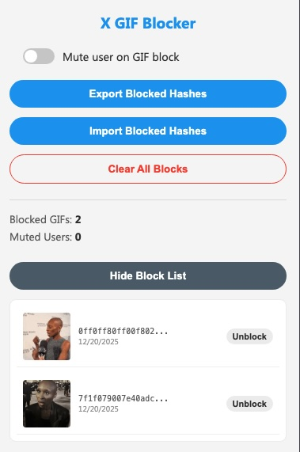

# x-gif-blocker

A Chrome extension to block annoying or repetitive GIFs on X. x-gif-blocker uses perceptual hashing to identify and hide GIFs based on its visual content, ensuring that even if the same GIF is re-uploaded or served from a different URL, it stays blocked.

  

##  Features

- **Visual Blocking**: Blocks GIFs based on their visual content, not just their filename or URL.
- **Contextual Menu Integration**: Adds a "Block this GIF" button directly to the tweet dropdown menu on X.
- **Auto-Mute Option**: Optionally mute the user who posted the GIF automatically when you block it.
- **Visual Block List**: View a gallery of all your blocked GIFs with thumbnails, hashes, and dates.
- **Unblock Management**: Easily unblock any GIF from the extension popup.
- **Import/Export**: Import/export your JSON blocklists.
- **Performance Optimized**: Uses lazy loading and offscreen canvas processing to minimize memory and CPU usage.

  

##  pHash (muh keys)

X converts uploaded GIFs into MP4 videos, which often results in unique URLs for the "same" content. This makes simple URL-based blocking ineffective.

This is resolved by using perceptual hashing (pHash):

1.  **Thumbnail Extraction**: Extract the static thumbnail associated with the gif.
2.  **Fingerprinting**: Generate a 256-bit "fingerprint" (hash) of the image's visual features using the Block Mean Value Based (BMVB) algorithm.
3.  **Hamming Distance**: When checking if a GIF should be blocked, it compares the fingerprint of the new GIF against your blocklist. If the "distance" (visual difference) is small, it treats them as the same image and hides the tweet.

This allows the extension to block the same GIF even if it has been slightly resized, re-encoded, or posted by a different user.

##  Usage

1.  Clone this repo
2.  Open Chrome and navigate to `chrome://extensions/`
3.  Enable **Developer mode** in the top right corner
4.  Click **Load unpacked**
5.  Select the `extension` folder within this project
6.  Go to `x.com` and block stuff
